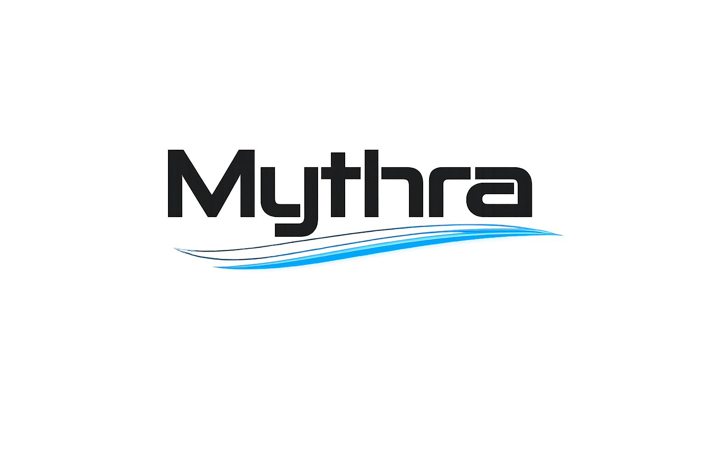
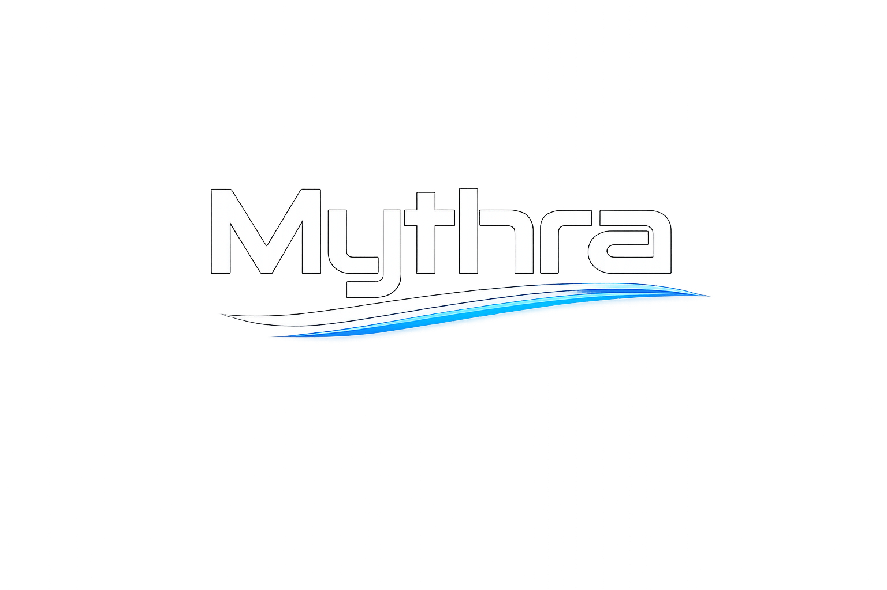

<p align="center">
  
</p>

# Mythra

Mythra is a desktop context studio for persistent AI assistants called Wizards. Each Wizard can use any supported OpenRouter or local model while carrying your selected Markdown instructions, knowledge, examples, corrections, and memory into every conversation.

At a glance, Mythra gives you:

- Persistent Wizards with their own model, system prompt, sessions, tools, and local Markdown context.
- Selectable always-on documents with a visible context estimate before you send.
- Normal saved chats when you do not need a persistent specialist.
- OpenRouter, LM Studio, and Ollama support, with model choice per Wizard.
- Search, web access, file tools, command execution, approvals, and other capabilities available when useful.
- Local ownership, editable Markdown, and portable Wizard import/export bundles.

> Status: Mythra is actively developed. Current app version: `0.9.4`.

## Contents

- [Why Mythra Exists](#why-mythra-exists)
- [Screenshots](#screenshots)
- [Feature Tour](#feature-tour)
- [Providers and Models](#providers-and-models)
- [Workspace and Agent Tools](#workspace-and-agent-tools)
- [Wizards](#wizards)
- [Nexus Projects](#nexus-projects)
- [Media Generation](#media-generation)
- [Privacy and Security](#privacy-and-security)
- [Install for Users](#install-for-users)
- [Run from Source](#run-from-source)
- [Project Structure](#project-structure)
- [Development Scripts](#development-scripts)
- [Release Process](#release-process)
- [Contributing](#contributing)
- [License](#license)

## Why Mythra Exists

Most AI chats make you repeat the same background, examples, corrections, and preferences whenever you begin again. Prompt presets help with instructions, but they are not a transparent, evolving body of context that you can inspect and own.

Mythra takes a different path. Its goal is to make specialized AI context persistent, visible, and portable:

- A Wizard receives its selected Markdown documents on every message.
- You can see which documents are included and how much context they consume.
- You can refine identity, personality, knowledge, memory, and corrections over time.
- You can switch models without rebuilding the Wizard.
- You can keep normal chat separate for one-off conversations.
- Tools remain available without turning Mythra into a coding environment.

Mythra is intentionally personal and transparent. It is closer to a workshop for shaping long-lived AI specialists than a generic chat box.

## Screenshots

The repository includes onboarding and brand assets used by the app. These are useful for understanding the product flow:

<p align="center">
  
</p>

<p align="center">
  
</p>

## Feature Tour

### Chat

Mythra has regular saved chats for conversation, research, planning, analysis, and lightweight tool use. Chat mode is not tied to a workspace, so it is good for general work where the model does not need to read or edit your files.

Chat supports:

- Saved conversation history.
- Global chat search across normal chats, Wizard sessions, and Nexus sessions.
- Reading prior chat messages when a model needs exact saved context.
- Per-chat model overrides.
- Pinned and draggable chat organization.
- Rich Markdown with GitHub-flavored formatting.
- Collapsible Thinking blocks for reasoning-capable models.
- Safe colored text tags.
- Interactive multiple-choice quiz blocks.
- Interactive charts, tables, and stat cards for numerical or finance-style answers.
- OpenRouter credit display and output cost estimates when enabled.
- A Web toggle for public web search when configured.
- A Stop button that aborts the active run.

### Agent Mode

Agent mode is where Mythra becomes a coding workspace. When a folder is open, the model can use tools to inspect and modify the project, subject to your tool settings and approval rules.

Agent mode can:

- List and search workspace files.
- Read source files and documents.
- Read PDFs, including OCR for low-text pages.
- Summarize long files and PDFs.
- Inspect local image files.
- Transcribe local audio files.
- Edit files.
- Rename, delete, or replace files when permitted.
- Run commands and tests.
- Show git diffs.
- List recently changed files.
- Update the system prompt when explicitly allowed.

Mythra no longer imposes a fixed tool-round cap. A run can continue until the model finishes, the provider errors, or you press Stop.

### Editor, Files, and Changes

The app is built around a three-pane desktop workflow:

- Left sidebar: chats, Wizards, files, media chat launchers, workspace actions.
- Center: active chat/thread.
- Right inspector: Editor, Changes, Settings, and productivity tools.

The file/editor workflow includes:

- File tree with workspace search and collapsible folders.
- Monaco-powered editor tabs.
- Dirty-state indicators.
- Language detection for common source and config files.
- Changes panel with file-grouped diffs.
- Hunk-level copy and discard actions.
- Tool activity history for understanding what the model did.

### Productivity Tools

Mythra includes a Tools/Productivity area for project-level work:

- Prompt snippets.
- Project settings.
- Tool history.
- Test summaries.
- Cost tracking.

These are intended to make repeated AI-assisted coding sessions easier to audit and resume.

## Providers and Models

Mythra supports three provider families:

### OpenRouter

OpenRouter is the hosted model provider path. Mythra uses OpenRouter through its OpenAI-compatible API surface.

OpenRouter support includes:

- Chat and streaming responses.
- Tool calling.
- Model search and selection.
- Reasoning effort controls for supported models.
- Credit balance display.
- Response cost estimates when usage and model pricing are available.
- Media model selection for supported image, audio/music, and video models.

Default base URL:

```text
https://openrouter.ai/api/v1
```

### LM Studio

LM Studio support is for local or LAN-served models that expose an OpenAI-compatible API.

Typical base URL:

```text
http://localhost:1234/v1
```

LM Studio is a good fit when you want local inference, offline-ish workflows, or to experiment with local models without sending project content to a hosted provider.

### Ollama

Ollama support is included for local models exposed through an Ollama-compatible local server.

Use Ollama when you want local model management and a simple local runtime.

## Workspace and Agent Tools

Mythra’s tool runtime is permission-aware. Tools are exposed based on the current mode, workspace, and Settings.

Tool access settings include:

- Read files.
- Write files.
- Workspace search.
- Command deck.
- AI can change system prompt.

Agent Autonomy currently includes:

- Full access mode.

When Full access is off, sensitive actions such as writes, deletes, commands, and system prompt changes may require approval. When Full access is on, Mythra can run those actions without per-action approval.

Workspace tools are designed around local project folders. Wizard sessions have their own workspace rules, including an optional "Allow paths outside workspace" setting for path-based file tools.

## Wizards

Wizards are persistent specialized assistants. A Wizard is not just a chat preset; it has its own local workspace folder and Markdown documents that define its identity, behavior, memory, and corrections.

Each Wizard can have:

- A name.
- A provider and model.
- A system prompt.
- A local workspace folder.
- Core Markdown documents.
- Additional custom Markdown documents.
- Per-Wizard Full access.
- Optional outside-workspace path access.
- Durable memories created during sessions.
- Export/import through `.mythwiz` bundles.

Default Wizard documents include:

- `identity.md`
- `personality.md`
- `tools.md`
- `memory.md`
- `corrections.md`

Every auto-injected Markdown file in the Wizard workspace becomes part of that Wizard’s context. This makes Wizards useful for:

- Writing style assistants.
- Brand voice assistants.
- Personal knowledge systems.
- Coding stack specialists.
- Research assistants.
- Meeting or journal workflows.
- Creative personas with a lore bible.

## Nexus Projects

Nexus is Mythra’s multi-Wizard collaboration mode.

A Nexus project has:

- A shared project workspace.
- A mission.
- A leader Wizard.
- Two or more Wizard members.
- Team settings.
- Optional parallel responses.
- Optional leader-mediated tool approvals.
- Project tasks and project status.

Nexus is designed for cases where one assistant is not enough: for example, a product planner, a coding specialist, and a writing/editorial assistant working through the same project.

## Media Generation

Mythra supports dedicated media chats from the bottom-left media launchers:

- Music
- Video
- Images

Media chats are tied to a matching media model. Generated media is stored locally with the chat so it can be viewed, played, saved, and cleaned up with the chat lifecycle.

Supported media behavior depends on the selected provider and model. OpenRouter is currently the primary path for video generation.

## Privacy and Security

Mythra is a local desktop app, but model providers still matter.

### What stays local

- Your app settings live under Electron `userData`.
- Generated media is stored locally.
- Wizard workspaces are local folders.
- Chat history is local app data.
- Local provider requests, such as LM Studio or Ollama, go to your configured local/server endpoint.

### What can leave your machine

If you use a hosted provider such as OpenRouter, the prompts, selected context, attachments, and tool results sent to that provider leave your machine according to that provider’s policies.

If you enable web search, search queries are sent to the configured search provider.

### Secret storage

Mythra protects API keys with Electron `safeStorage` when OS encryption is available.

Encrypted fields include:

- LM Studio API key
- OpenRouter API key
- Ollama API key
- Tavily API key
- Brave Search API key

Backends:

| Platform | Backing store |
| --- | --- |
| macOS | Keychain |
| Windows | DPAPI |
| Linux | Secret service, when available |

If OS encryption is unavailable, Mythra keeps working and stores settings in the fallback format for that platform.

### Tool safety

Tool execution is guarded by:

- Workspace scope checks.
- Tool access settings.
- Runtime validation.
- Approval prompts for sensitive actions when Full access is off.
- Structured tool activity shown in the UI.

## Install for Users

Signed, notarized builds are published with this source repository:

[Mythra Releases](https://github.com/m17h/Mythra/releases)

Typical release assets include:

- `Mythra <version>.dmg` for macOS direct install.
- `Mythra-<version>-arm64-notarized.zip` for macOS auto-update.
- `Mythra-Setup-<version>.exe` for Windows install.
- `latest-mac.yml` and `latest.yml` for Electron auto-updater metadata.

The app’s built-in updater checks this repository’s public releases.

## Run from Source

### Requirements

- Node.js 20+ recommended.
- npm.
- macOS, Windows, or Linux for development.
- Optional: LM Studio or Ollama for local models.
- Optional: OpenRouter API key for hosted models.

### Setup

```bash
git clone https://github.com/m17h/Mythra.git
cd Mythra
npm install
npm run dev
```

### Configure a model provider

Open Settings in Mythra and choose a provider:

- OpenRouter: paste an API key and choose a model.
- LM Studio: start the LM Studio local server and use its base URL.
- Ollama: start Ollama and select an available model.

## Project Structure

```text
.
├── Images/                 App logo, onboarding, and background assets
├── build/                  App icons and updater config used by electron-builder
├── scripts/                Packaging/icon helper scripts
├── src/
│   ├── main/               Electron main process, model service, stores, tools
│   ├── preload/            Safe renderer <-> main IPC bridge
│   ├── renderer/           React UI, panels, editor, chat components, styles
│   └── shared/             Shared types, themes, provider profiles, embeds
├── tests/                  Playwright smoke tests
├── ARCHITECTURE.md         Architecture notes and security model details
├── releases.md             Release asset process
└── package.json            Scripts, app metadata, dependencies
```

## Development Scripts

```bash
npm run dev       # Start Electron/Vite development mode
npm run build     # Build main, preload, and renderer output
npm run check     # TypeScript typecheck
npm test          # Run Vitest unit tests
npm run test:e2e  # Build and run Playwright Electron smoke test
npm run dist:mac  # Build macOS app directory with electron-builder
```

## Release Process

The detailed release process is in [`build.md`](build.md) and [`releases.md`](releases.md).

High-level flow:

1. Bump version.
2. Run validation.
3. Commit and push source changes.
4. Clean `dist`.
5. Build the signed macOS app.
6. Notarize and staple the macOS app.
7. Create the notarized updater zip.
8. Build the Windows installer.
9. Create, sign, notarize, and staple the DMG.
10. Build the release asset folder.
11. Update `Release Assets/release_notes.md`.
12. Upload assets to this repository’s GitHub release.

## Contributing

Mythra is now public and open source. Contributions are welcome, especially in these areas:

- Provider compatibility.
- Local model support.
- Tool reliability and safety.
- UI polish.
- Accessibility.
- Testing.
- Documentation.
- Packaging and release automation.

Before making a larger change, open an issue or discussion with the goal and proposed approach. For code changes, please run:

```bash
npm run check
npm test
npm run build
```

For UI or Electron-shell changes, also run:

```bash
npm run test:e2e
```

## License

This repository does not currently include a `LICENSE` file. Since the project has just moved into the open, add an explicit license before relying on the code for redistribution, reuse, or packaged forks.
